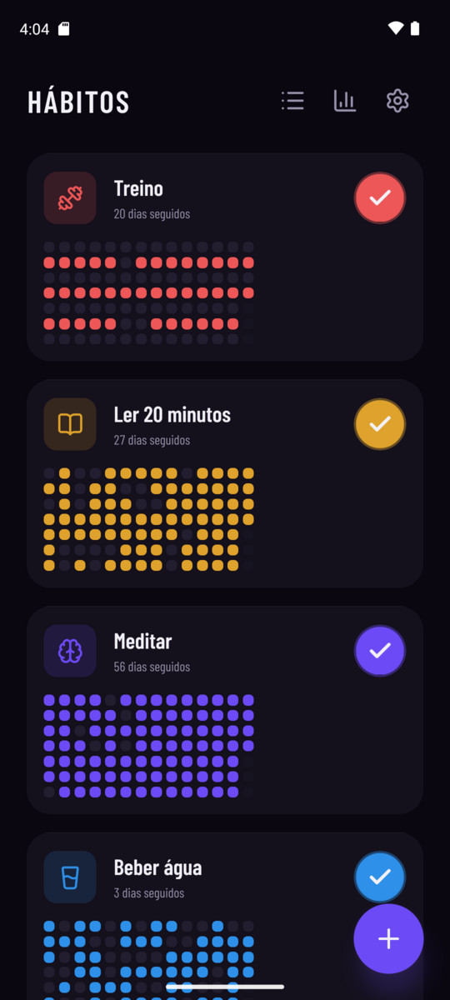
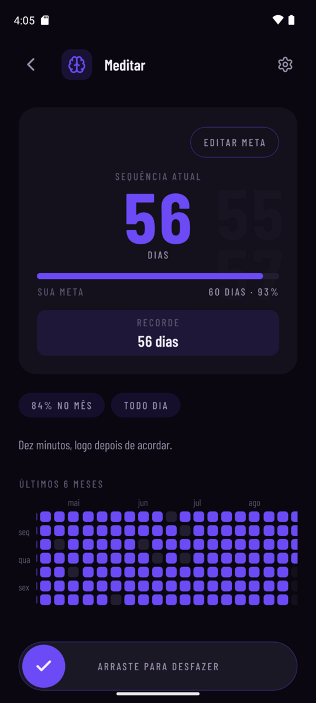
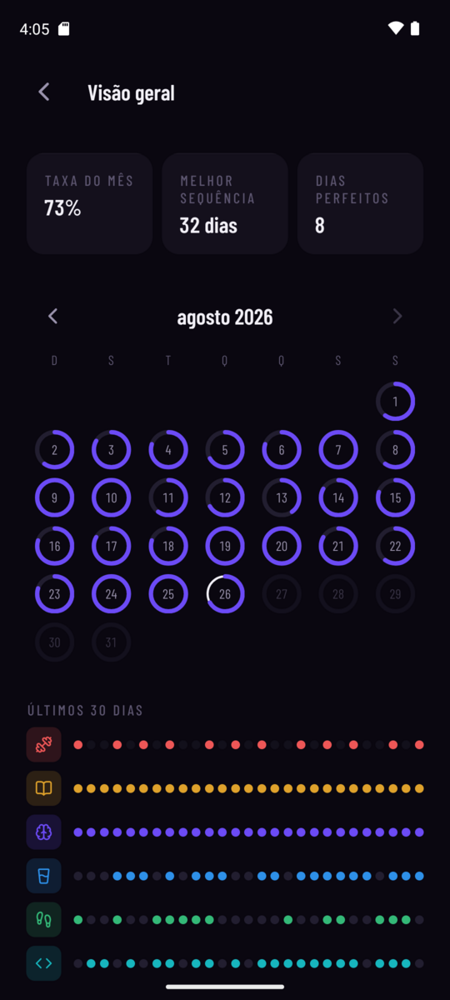
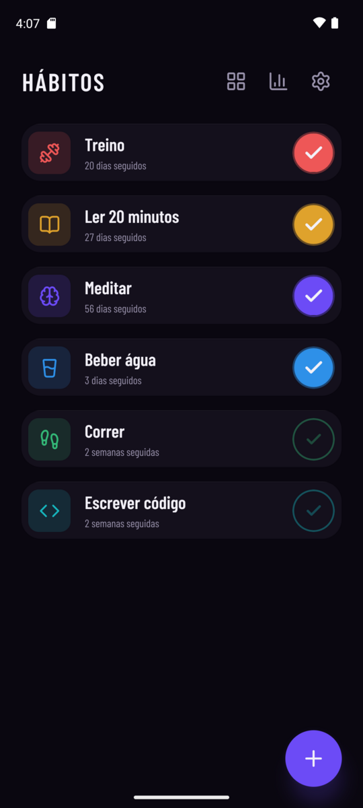
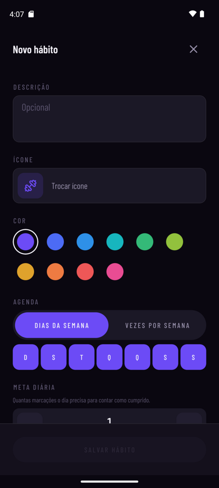
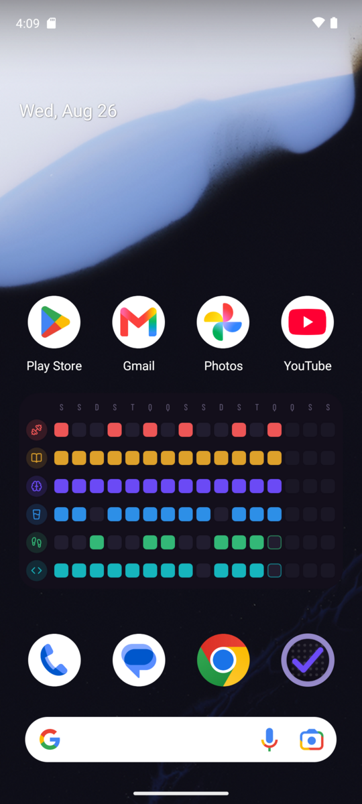

<div align="center">


# Hábitos

**Um rastreador de hábitos para Android que não pede conta, não pede internet e não sabe nada sobre você.**

Os dados vivem no aparelho. Saem de lá só num arquivo que você exporta.

[](https://docs.expo.dev/versions/v57.0.0/)
[](https://reactnative.dev)
[](https://www.typescriptlang.org)
[](#testes)
[](https://claude.com/claude-code)

</div>

---

<div align="center">









</div>

---

## O que ele faz

**Hábitos**
- Criar, editar, arquivar, excluir e reordenar por arraste
- ~150 ícones Lucide curados, com busca, mais uma aba de emoji
- Paleta fechada de 10 cores, com luminância normalizada — nenhuma grita mais alto que a outra
- Descrição opcional e meta diária (`marcar N vezes para o dia contar`)

**Agenda**
- Por dias da semana (seg, qua, sex) **ou** N vezes por semana — o compromisso é semanal, não diário
- Dia fora da agenda é neutro: não soma e não quebra a sequência
- Virada do dia configurável (padrão 04:00), porque marcar à 00:40 ainda é "ontem"

**Acompanhamento**
- Sequência atual e recorde, com meta de sequência e barra de progresso
- Heatmap dos últimos 6 meses e calendário mensal navegável
- Nota por dia, com pressão longa
- Passado editável sem limite; futuro renderizado apagado e inerte

**Visão geral**
- Calendário onde cada dia é um anel preenchido na proporção dos hábitos cumpridos
- Taxa do mês, melhor sequência viva e contagem de dias perfeitos
- Matriz de hábitos × últimos 30 dias

**Widgets na tela inicial**
- Três entradas no seletor: hábito pequeno, hábito médio e lista compacta
- O toque na bolinha de hoje marca e desmarca direto da tela inicial
- Leem um snapshot JSON, nunca o banco — o contexto headless não garante acesso ao SQLite

**Lembretes**
- Um horário por hábito, disparado só nos dias agendados
- Reagendados sozinhos ao salvar, arquivar, excluir e no boot do aparelho

**Backup**
- Exportar e importar JSON pelo Storage Access Framework: quem escolhe a pasta é você
- A importação funde por `updated_at` — entra a linha que não existe aqui ou que é mais recente
- Reimportar o mesmo arquivo não muda nada
- A exclusão é suave, então apagar aqui apaga também em quem importar o arquivo depois

**Interface**
- Tema escuro, tipografia condensada, pt-BR
- Dois modos na tela inicial: card com grid ou lista compacta
- Layout responsivo: 1, 2 ou 3 colunas conforme a largura, do celular ao tablet

## O que ele não faz, por decisão

Sem conta. Sem servidor. Sem telemetria. Sem anúncios. Sem paywall.
Nenhuma tela espera rede para renderizar — não há nenhuma chamada de rede no código.

## Tecnologias

| Camada | Escolha |
|---|---|
| Runtime | [Expo SDK 57](https://docs.expo.dev/versions/v57.0.0/) · React Native 0.86 · New Architecture |
| UI | React 19.2 com React Compiler · [Reanimated 4](https://docs.swmansion.com/react-native-reanimated/) · Gesture Handler · `react-native-svg` |
| Navegação | [Expo Router](https://docs.expo.dev/router/introduction/) com rotas tipadas |
| Dados | [`expo-sqlite`](https://docs.expo.dev/versions/v57.0.0/sdk/sqlite/) + [Drizzle ORM](https://orm.drizzle.team) com migrações versionadas |
| Widget | [`react-native-android-widget`](https://saleksovski.github.io/react-native-android-widget/) |
| Notificações | `expo-notifications` |
| Arquivos | `expo-file-system` (Storage Access Framework) |
| Tipografia | Barlow Condensed, pesos 300–700, no app e no widget |
| Ícones | `lucide-react-native`, com a geometria extraída para SVG no widget |
| Linguagem | TypeScript strict · ESLint com regras de arquitetura |
| Testes | [Vitest](https://vitest.dev) sobre o domínio puro |

Sem NativeWind: o estável é anterior a RN 0.86 e o design é fechado em ~15 componentes,
então o ganho não pagaria o atrito com Reanimated 4.

## Arquitetura

```
src/domain/    puro. Sem React, sem banco, sem UI, sem Date.now(). É o que tem teste.
src/data/      adapters finos: Drizzle, arquivos, notificações. Sem regra de negócio.
src/ui/        design system fechado. Sem regra de negócio, sem acesso a dados.
src/features/  telas compostas, uma pasta por tela.
src/app/       rotas do expo-router. Finas: só montam a feature correspondente.
src/widget/    os três widgets da tela inicial.
```

Três regras seguram o resto:

- **`src/domain/` não importa React, banco nem UI.** Isso é validado por lint, não por combinado.
- **O relógio é parâmetro, nunca global.** Nenhuma função de domínio chama `new Date()` sem argumento.
  Quem sabe que horas são é a borda — e é por isso que a virada às 4h dá para testar.
- **Nenhum valor visual solto.** Hex literal, número de espaçamento e `fontFamily` fora de
  `src/ui/theme.ts` são erro de lint.

O dia é sempre uma `string` `YYYY-MM-DD` em horário local. Nunca UTC, nunca timestamp,
nunca `toISOString()` — que converte para UTC e erra o dia.

O [`PRD.md`](PRD.md) é a fonte da verdade do produto: as decisões, o modelo de dados,
as regras de domínio e o porquê de cada uma.

## Rodando

Precisa de um **development build**: o app usa módulos nativos (SQLite, widget, notificações),
então o Expo Go não serve.

```bash
npm install
```

```bash
npm run android
```

Depois do primeiro build nativo, o dia a dia é só o servidor:

```bash
npm start
```

### Testes

O domínio inteiro é testado — 116 testes sobre funções puras, sem mock e sem banco.

```bash
npm test
```

### Lint

```bash
npm run lint
```

### Geradores

Os PNGs e os paths de ícone gerados vão para o git: o build não depende de rodar nada.

```bash
python3 scripts/gerar-icones.py
```

```bash
node scripts/gerar-icones-do-widget.mjs
```

## Feito com Claude Code

Este projeto foi escrito com [**Claude Code**](https://claude.com/claude-code), do PRD ao widget.

O fluxo foi o mesmo do começo ao fim: o [`PRD.md`](PRD.md) nasceu de uma entrevista e virou a
fonte da verdade; o [`.cursorrules`](.cursorrules) carrega as regras invioláveis de arquitetura,
datas e design; o [`AGENTS.md`](AGENTS.md) trava a única coisa que um modelo erra sozinho — ler a
documentação da versão exata do Expo antes de escrever qualquer linha, porque o SDK mudou e o
conhecimento de versões anteriores está errado com frequência; e cada entrega atravessou
UI → domínio → persistência numa fatia vertical, com um commit por passo. As regras que dá para
verificar por máquina — o domínio não importar React, nenhum hex solto em componente — viraram
regra de lint, não combinado.

## Licença

[MIT](LICENSE).
